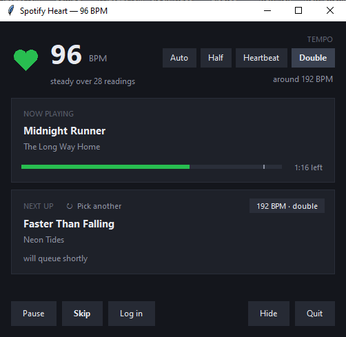
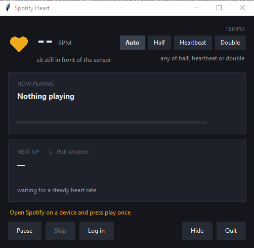

# Spotify Heart

Queues Spotify songs whose tempo matches your heart rate.

A Seeed MR60BHA2 60 GHz mmWave radar (XIAO ESP32-C6) measures your heart rate
without contact. A small Windows app reads it over USB, looks up songs with a
matching BPM (or half or double it), and adds one to your Spotify queue just
before the current track ends. It lives in the tray, with a window for when you
want to see what is going on.



- Heart rate: Seeed MR60BHA2 radar, native ESP-IDF firmware in `esp32-heartrate/`
- Playback: Spotify Web API (Premium account), tray app in `windows-applet/`
- Tempo data: GetSongBPM

## How it works

```
 MR60BHA2 radar ──UART──▶ XIAO ESP32-C6 ──USB serial──▶ Windows tray app
 (60 GHz, 0.4–1.5 m)      "heart_rate: 79.00"          │
                                                       ├─ smooth 30 s of readings, lock on a BPM
                                                       ├─ GetSongBPM: songs at that tempo (±3, or ×½ / ×2)
                                                       ├─ Spotify search: title + artist → track URI
                                                       └─ ~15 s before the current track ends: queue it
```

The song is chosen as soon as the current one starts, so the moment it queues
holds nothing but the queue call. Between polls the app advances Spotify's
reported position with its own clock, so a four-minute track costs about six
API calls rather than fifty.

The board does one thing: it decodes the radar's frames and prints one
`heart_rate: NN.NN` line per reading at 115200 baud, about once a second when
someone is sitting still in front of it (and `0.00` when nobody is). Everything
else, including the Spotify login, runs on the PC.

## The window



- **Heart rate**, beating in time with the reading, with a coloured dot that
  matches the tray icon: grey no sensor, amber settling or a stale reading,
  green steady, red needs a Spotify login.
- **Now playing**, with a progress bar. The faint mark on the bar is where the
  next song will be queued.
- **Next up**, the song already chosen, with its tempo and whether it is
  matched to your heart rate, its half or its double. It says *will queue
  shortly*, then *queued, plays next* once Spotify has accepted it.
  **Pick another** swaps it for a different song, remembering what you turned
  down so it does not offer the same track back.
- **Tempo**: Auto, Half, Heartbeat or Double. Changing it throws away the
  waiting choice and picks again at once. A choice that lands outside
  40–220 BPM (half of 78 is 39) falls back to matching freely and says so.
- Buttons for Pause, Skip, Log in, Hide and Quit.

Closing the window hides it in the tray; left-clicking the tray icon brings it
back. The tray menu carries the same actions, so `--no-window` is a perfectly
usable way to run it.

## Hardware

- [Seeed Studio MR60BHA2](https://www.seeedstudio.com/MR60BHA2-60GHz-mmWave-Sensor-Breathing-and-Heartbeat-Module-p-5945.html)
  breathing and heartbeat module. It ships with a XIAO ESP32-C6 already
  attached; the radar talks to the C6 over its UART0 pins (GPIO16/17).
- A USB-C cable to the PC. The C6's native USB-Serial/JTAG port is used for
  both flashing and the heart-rate output, so no extra adapter is needed.
- Position: the subject should sit still roughly 40 cm to 1.5 m from the
  radar, facing it.

## Repository layout

```
esp32-heartrate/     ESP-IDF firmware for the XIAO ESP32-C6 (pure C, no Arduino)
  main/              frame parser, MR60BHA2 decoder, UART task
  test/              host unit tests + raw frame captures from the real board
  PLAN.md            design notes, protocol reference, hardware findings
windows-applet/      Python tray app
  spotify_heart/     the package (serial reader, smoother, DJ loop, Spotify + GetSongBPM clients, window, tray)
  tests/             pytest suite with sanitised API fixtures
  tools/             fake sensor for testing without hardware, API probe, screenshots
  docs/              screenshots used by this README
  config.example.json
  PLAN.md            design notes and development log
```

## Installation

### 1. Firmware

You need [ESP-IDF](https://docs.espressif.com/projects/esp-idf/en/stable/esp32c6/get-started/index.html)
5.2 or newer with the ESP32-C6 target (the Windows installer is the easiest
route). Then, in an ESP-IDF shell:

```bash
cd esp32-heartrate
idf.py set-target esp32c6
idf.py build
idf.py -p COM3 flash monitor
```

Replace `COM3` with the port the board shows up on (Device Manager lists it as
"USB Serial Device", vendor `303A` product `1001`). No BOOT button is needed;
if flashing ever fails with "No serial data received", hold BOOT, tap RESET,
release BOOT and try again.

The monitor should show one `info:` line and then `heart_rate:` lines. Sit
still in front of the radar and real values (roughly 50 to 110) appear about
once a second. Quit the monitor before starting the app: only one program can
hold the port.


### 2. Windows app

Prerequisites, all done once:

1. A Spotify **Premium** account (playback control needs it).
2. A Spotify app: go to the [developer dashboard](https://developer.spotify.com/dashboard),
   create an app, tick "Web API", and add the redirect URI
   `http://127.0.0.1:8888/callback`. Note the **Client ID**. No client
   secret is needed (the app uses PKCE).
3. A free [GetSongBPM API key](https://getsongbpm.com/api). It can take a few
   minutes to activate after sign-up.
4. Python 3.11 or newer.
5. A Spotify player (desktop or phone) that has played something recently on
   that account, so Spotify has an "active device" to queue on.

Install and configure:

```powershell
cd windows-applet
py -3 -m venv .venv
.\.venv\Scripts\pip install -r requirements.txt
.\.venv\Scripts\pip install -e .
copy config.example.json config.local.json
```

Open `config.local.json` and fill in `spotify_client_id` and `getsongbpm_key`.
That file is git-ignored and is the only place the keys live. Then log in:

```powershell
.\.venv\Scripts\python -m spotify_heart --login
```

A browser window opens for the Spotify consent screen; tokens are saved to
`tokens.json` next to the config. Windows Firewall may ask about the login
helper the first time; it only listens on `127.0.0.1`.

Try it in the console first, with the board plugged in and Spotify playing:

```powershell
.\.venv\Scripts\python -m spotify_heart --console --dry-run
```

You should see `[serial] connected`, a heart-rate lock after a few seconds,
and `dry-run: would play ...` with a track. Drop `--dry-run` to let it queue
for real, or start the tray app:

```powershell
.\.venv\Scripts\pythonw -m spotify_heart
```

That opens the window and puts a heart in the tray. Add `--hidden` to start in
the tray only (what a run-at-startup shortcut should use), or `--no-window`
for the tray on its own. On a machine without tkinter the app falls back to
tray-only by itself.

If `config.local.json` is not present, the app uses
`%APPDATA%\SpotifyHeart\config.json` instead and keeps its tokens, cache and
logs there.

## Configuration

`config.local.json` keys (defaults shown in `config.example.json`):

| Key | Meaning |
|---|---|
| `spotify_client_id` | From the Spotify developer dashboard. |
| `getsongbpm_key` | From getsongbpm.com/api. |
| `serial_port` | `auto` finds the board by USB ID; or a port name such as `COM5`. |
| `hr_window_s`, `hr_min_readings`, `hr_max_spread` | How much steady data is needed before the heart rate is "locked". |
| `hr_min`, `hr_max` | Readings outside this range are ignored. |
| `hr_stale_s` | How long a heart-rate lock is still used after the readings stop (the listener may have walked away). |
| `bpm_tol` | Song tempo tolerance in BPM. |
| `allow_half_double` | Also accept songs at half or double the heart rate. |
| `tempo_mode` | `auto`, `half`, `same` or `double`: which match to use. The window's Tempo buttons set this for the session. |
| `genres` | Only pick songs whose artist has one of these genres, e.g. `["rock", "pop"]`. Empty means any. GetSongBPM supplies the genres, so this costs no extra requests. |
| `poll_s` | How often the app checks what Spotify is playing. |
| `queue_lead_ms` | How long before the end of the current track to queue the next one. |
| `no_repeat_n` | Number of recent tracks not to pick again. |
| `dry_run` | Same as `--dry-run`. |

Command-line flags: `--login`, `--console`, `--dry-run`, `--hidden`,
`--no-window`, `--port COMn`, `--pick N` (print one track for heart rate N and
exit), `--probe` (call every external API once and save fixtures),
`--fake-sensor FILE` (read `heart_rate:` lines from a file or `-` instead of
the board), `--config PATH`.

## Troubleshooting

| Symptom | Cause and fix |
|---|---|
| `[serial] board not found` | Board not plugged in, or another program (serial monitor, Arduino IDE) holds the port. Close it. |
| Board reboots when the app connects | The C6 resets on DTR/RTS changes. The app opens the port with both low; other tools may not. |
| Lines are all `heart_rate: 0.00` | Nobody in range, or the subject is moving. Sit still 40 cm to 1.5 m away. |
| Spotify 404 "no active device" | Open Spotify on a device and press play once, then the app can queue. |
| Spotify 403 | The account is not Premium, or the login account is not the app owner in the developer dashboard (development-mode apps only allow allow-listed users). |
| Spotify 429 | Rate limited; the app backs off. Increase `poll_s` if it keeps happening. |
| GetSongBPM errors right after sign-up | The key takes a few minutes to activate. |
| No window, only a tray icon | tkinter is missing from the Python install, or `--no-window` is set. The log says which. |
| "Half" or "Double" picks the wrong multiple | That multiple fell outside 40–220 BPM, so it matched freely instead. The line under the Tempo buttons says so. |
| Board boot-loops with "Interrupt wdt timeout" | ESP-IDF UART clock bug on the C6; this firmware already works around it. If you changed `radar_task.c`, keep the clock enable before `uart_param_config`. |

## Development

- Windows app tests: `.\.venv\Scripts\pip install -r requirements-dev.txt`
  then `.\.venv\Scripts\python -m pytest` inside `windows-applet/`.
- Firmware host tests: `esp32-heartrate\test\run_tests.ps1 -Fixtures` (needs
  a C compiler; the script looks for TinyCC). The fixtures are raw frame
  captures from the real board, with and without a person present.
- Frame dump build for the bench: see `esp32-heartrate/sdkconfig.dump`.
- The screenshots in `windows-applet/docs/` are generated, with made-up tracks:
  `.\.venv\Scripts\python tools\screenshot_window.py`.
- The radar's serial protocol (frame layout, checksum, message types, and what
  the sensor actually sends) is written up in `esp32-heartrate/PLAN.md`
  section 1.
- Both `PLAN.md` files double as the development log, with a status table at
  the top.


## Credits

Tempo data provided by [GetSongBPM](https://getsongbpm.com)

Radar protocol details were taken from the
[Seeed Arduino mmWave library](https://github.com/Seeed-Studio/Seeed_Arduino_mmWave).

## License

Public domain, under the [Unlicense](https://unlicense.org). See `LICENSE`.
